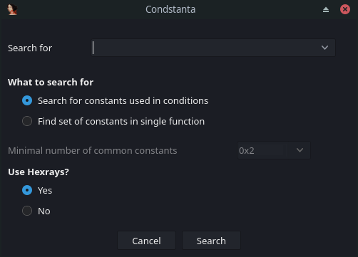
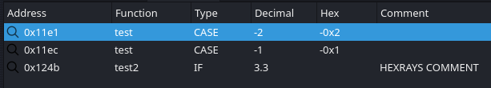

# Condstanta v1.0

## Introduction

Condstanta is a plugin that allows searching for constant values that are used in conditional statements such as `if` and `switch-case` or for functions that contain multiple specific constants. The plugin allows searching for exact numbers, number ranges and list of specific constants.

## Installation

Copy the `condstanta.py` file to IDA plugin folder.

## Usage

The plugin can be started from `Search` menu by selecting the `Condstanta` option. The dialog window for search specification offers several fields:

* **Search for**: The value to look for. Possible values are:
    * Exact numbers: `100`, `0xabc` or `-2.3`
    * Ranges (both edge cases are included): `0:10`, `-10:0xf`, `3:3.9`
    * List of values: `-1, 2, 0x45, 1.3`
    * Empty field means find all numbers (only applicable for the `Search for constants used in conditions`)
* **What to search for**: Type of the search that is to be performed. `Search for constants used in conditions` will only look for constants that are used in `if`, `case` and `while` statements. The option `Find set of constants in single function` will take range or list of values and find all functions that contain multiple of the constants from the given list (the required amount is determined by the `Minimal number of matching constants` which must be set to 2 or higher).
* **Use Hexrays**: Whether to use Hexrays decompiler for the search or not (only usable when the decompiler is available).

The results of the search operation are presented in form of a new view with a table (shown below). Double-click on a row will jump to the location marked in the `Address` column.

* **Address** - Address where the constant was found.
* **Function** - Name of the function where this constant was found.
* **Type** - `IF`, `CASE` and `LOOP`. Only applicable to `Search for constants used in conditions`, otherwise empty.
* **Decimal** - Decimal value of the number.
* **Hex** - Hex value of the number (empty for floats).
* **Comment** - Extracted comment from the location where the constant was detected. In Hexrays mode shows the Hexrays comment, otherwise comments in disassembly.

### Issues and Warnings

* The plugin performs the search only in body of functions and thus it will not look at any disassembly that is not marked as a function.
* Hexrays mode available only for limited set of architectures and is slower (it must decompile all functions).
* Assembly mode is attempting to be architecture agnostic; this may occasionally lead to missed constants or false positive hits with architectures such as ARM or PPC which use two instructions to load large numbers. With some more exotic architectures, this mode might miss constants completely.
* Using Hexrays mode will show Hexrays comments only (CASE comments do not work), using assembly mode shows the assembly comments only.
* Float constants are only found with Hexrays.

